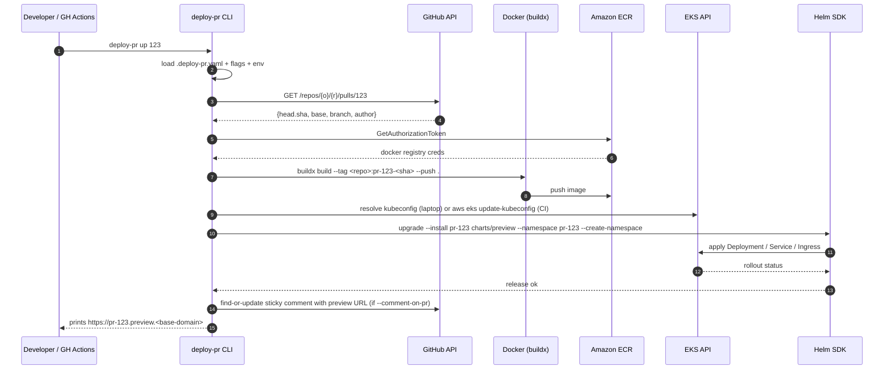

# feat: deploy-pr CLI for ephemeral PR preview environments on EKS

## Overview

`deploy-pr` is a Go CLI that turns a GitHub pull request into a self-contained, ephemeral preview environment running on Amazon EKS. A developer (or a GitHub Actions workflow) runs `deploy-pr up <PR#>`; the tool resolves the PR's head SHA, builds and pushes a container image to ECR, then renders and applies a Helm chart that creates a per-PR namespace with its own deployment, service, and ingress at `pr-<N>.preview.<base-domain>`. `deploy-pr down <PR#>` reverses the process. The same binary works on a developer laptop (interactive AWS SSO) and inside CI (AWS OIDC role assumption).

The goal is to ship one binary that owns the full path from a PR number to a reachable URL, with no separate webhook service to operate.

---

## Problem Frame

Reviewing UI and integration changes against text-only diffs is lossy. Spinning a preview environment by hand for every PR (build → tag → push → kubectl/helm → DNS → URL → comment back on PR) is ~10 minutes of toil, mostly fragile shell. A focused CLI collapses that to one command and lets reviewers click a link in the PR. The same logic, run from GitHub Actions on `pull_request` events, makes previews automatic and self-cleaning.

This plan covers a greenfield repo at `C:\Users\aguia\Dev\pessoal\deploy-pr` (no existing code), targeting AWS EKS with ECR. It does not assume an existing Helm chart, ingress controller install, or DNS automation — those prerequisites are documented as cluster-side requirements the operator owns.

---

## Requirements Trace

- R1. **PR resolution.** Given a PR number and a repo (defaulted from current `git` remote), the CLI resolves head SHA, branch, author, and base ref via the GitHub API.
- R2. **Image build & push.** The CLI builds an OCI image from the PR commit and pushes it to a configurable ECR repository, tagged `pr-<N>-<short-sha>` and `pr-<N>-latest`.
- R3. **Per-PR Helm release.** The CLI installs/upgrades a Helm release named `pr-<N>` in namespace `pr-<N>`, parameterised by image tag, hostname, and replica count.
- R4. **Reachable URL.** After `up`, the CLI prints (and optionally comments on the PR) the canonical preview URL `https://pr-<N>.preview.<base-domain>`.
- R5. **Idempotent re-deploy.** Re-running `up` on a PR that already has a live preview rolls a new image without recreating the namespace or losing configuration.
- R6. **Teardown.** `deploy-pr down <PR#>` uninstalls the Helm release and deletes the namespace.
- R7. **Listing.** `deploy-pr list` shows currently active previews (PR number, image tag, age, URL, status).
- R8. **Dual-mode auth.** Works on a laptop with `aws sso login` + a local kubeconfig, and inside GitHub Actions via OIDC role assumption, without code changes.
- R9. **CI integration.** A reference `.github/workflows/preview.yml` in the repo runs `up` on `pull_request` opened/synchronize/reopened and `down` on closed, with concurrency guarded per PR.
- R10. **Non-interactive friendly.** No TTY prompts in the default path; structured logs (text by default, `--log-format=json` opt-in); deterministic exit codes (`0` success, `1` user error, `2` infrastructure error).
- R11. **Safe failure.** A failed build/push leaves no half-applied Helm release; a failed deploy is reported with the kubectl/helm error context, not swallowed.

---

## Scope Boundaries

- Not a webhook server, GitHub App, or always-on controller. The CLI is invoked on demand (laptop or CI runner).
- Not a multi-cloud abstraction. EKS + ECR only; other K8s flavors are out of scope for v1.
- Not a Helm chart authoring framework. The plan ships *one* opinionated chart suited to a typical web service; chart-per-app reuse is a follow-up.
- Not a secrets manager. The chart accepts secret values via Helm values or referenced `Secret` names; provisioning those secrets is the operator's responsibility (recommend External Secrets Operator separately).
- Not a database/migrations runner. Previews are stateless; database-coupled previews are a follow-up.
- Not a DNS provisioner. The plan assumes ExternalDNS is already running in the cluster against a Route 53 zone; the chart only emits ingress records.

### Deferred to Follow-Up Work

- Stateful preview support (per-PR database, seeded fixtures): future iteration once the stateless flow is proven.
- `deploy-pr reap --older-than <duration>` for orphaned previews when CI teardown fails: deliberately deferred — GitHub Actions `closed` event is the primary teardown path; reap is a safety net we can add after observing real failure modes.
- Multiple chart support (`--chart-name api|web|worker`): start with a single chart; generalise once a second app needs it.
- Per-PR seeded data: out of scope.

---

## Context & Research

### Relevant Code and Patterns

Greenfield repo — no existing code. The plan leans on well-established external tools and libraries rather than internal conventions.

### Institutional Learnings

No `docs/solutions/` exists yet. None to consult.

### External References

These are not pre-fetched; the implementer should verify against current docs at execution time. Listed as the canonical surfaces this plan depends on:

- AWS: configuring OpenID Connect in IAM (GitHub Actions trust), `aws-actions/configure-aws-credentials@v4`, ECR `GetAuthorizationToken`, EKS `update-kubeconfig` semantics.
- Helm Go SDK (`helm.sh/helm/v3`): action.Install / action.Upgrade / action.Uninstall, kube client construction, `--create-namespace` semantics.
- Kubernetes: `client-go` for namespace and listing operations, `ingress-nginx` annotations, `ExternalDNS` host record annotation.
- GitHub: `google/go-github` for PR reads and issue comments; sticky-comment pattern (find-or-create by marker).
- Cobra + Viper for command structure and config layering (flags > env > config file > defaults).

---

## Key Technical Decisions

- **Language: Go.** Single static binary, first-class libraries for every dependency surface (AWS SDK v2, Helm SDK, client-go, go-github, Cobra), and idiomatic for K8s tooling.
- **Helm over Kustomize/raw YAML.** `helm upgrade --install` is idempotent (covers R5), `helm uninstall` is a clean teardown (covers R6), and Helm's release-tracking maps one-to-one to PRs. Kustomize would require us to build release tracking ourselves.
- **Image tag = `pr-<N>-<short-sha>`.** Includes both PR and SHA so re-deploys roll cleanly and `list` can show what commit is live. A floating `pr-<N>-latest` tag is also pushed for easy debugging but is never trusted by the deployment.
- **Namespace per PR (`pr-<N>`).** Simple isolation, simple teardown (`kubectl delete ns`). Preview namespaces share a labelled selector (`app.kubernetes.io/managed-by=deploy-pr`) so `list` and any future reaper can find them.
- **Auth precedence.** AWS: default credentials chain (env > shared config > SSO > IMDS) — same code path serves laptop and CI. Kube: `KUBECONFIG` env > `~/.kube/config` > in-cluster (the CLI is not expected to run in-cluster, but the path is free with client-go). GitHub: `GITHUB_TOKEN` env > `gh auth token` shellout > explicit `--github-token`.
- **Helm SDK over shelling out to `helm`.** Removes a runtime dep and gives typed errors. The chart on disk is still a normal Helm chart and can be installed by hand with `helm` for debugging.
- **Docker shellout for image build.** Re-implementing BuildKit in-process is not worth it; we shell out to `docker buildx build --push` once authenticated to ECR. Documented as a runtime prerequisite.
- **Sticky PR comment.** One comment per PR, marked with an HTML comment marker (`<!-- deploy-pr:preview -->`) so the CLI can find and update it across re-deploys instead of spamming new comments.
- **AWS auth in CI: OIDC, no static keys.** GitHub Actions assumes an IAM role via OIDC. The plan ships a sample trust policy but the operator owns its deployment.
- **Config file: `.deploy-pr.yaml` at repo root.** Holds non-secret defaults: ECR repo URI, EKS cluster name + region, base domain, chart path. Flags and env vars override.

---

## Open Questions

### Resolved During Planning

- *What "deploy a PR" means here* — ephemeral preview env per PR (decided in conversation).
- *Manifest tooling* — Helm with one chart per release (decided in conversation).
- *Image build location* — local Docker, pushing to ECR (decided in conversation).
- *Invocation surface* — developer CLI plus GitHub Actions workflow with AWS OIDC (decided in conversation).
- *Cluster flavor* — EKS, single cluster targeted via config (assumed from "AWS Kubernetes"; flagged as an explicit assumption — re-open if other flavors are in play).

### Deferred to Implementation

- Exact Helm SDK version pin once Go module is initialised (latest stable v3 line).
- Whether `docker buildx build --push` or a separate `docker push` step gives better error surfaces in CI runners — pick at implementation time after one CI run.
- Whether to use `client-go` directly or piggyback on Helm's kube client for the `list` command. Marginal; choose whichever produces shorter code.
- The exact set of IAM permissions on the OIDC role: start from least privilege (ECR push on the configured repo + `eks:DescribeCluster` + STS `GetCallerIdentity`) and expand only if a real call fails.

---

## Output Structure

```text
deploy-pr/
├── .deploy-pr.yaml                 # sample config (committed)
├── .github/
│   └── workflows/
│       └── preview.yml             # reference CI workflow (U8)
├── README.md                       # quickstart + AWS prerequisites (U9)
├── go.mod
├── go.sum
├── main.go                         # thin entry; defers to cmd
├── cmd/
│   ├── root.go                     # cobra root, config loading, logging (U1)
│   ├── up.go                       # `deploy-pr up <PR#>` (U5 wiring)
│   ├── down.go                     # `deploy-pr down <PR#>` (U5 wiring)
│   └── list.go                     # `deploy-pr list` (U7)
├── internal/
│   ├── config/
│   │   └── config.go               # viper-backed config struct (U1)
│   ├── github/
│   │   ├── client.go               # PR resolution (U2)
│   │   └── comment.go              # sticky PR comment (U6)
│   ├── ecr/
│   │   └── auth.go                 # ECR token + docker login (U3)
│   ├── docker/
│   │   └── build.go                # buildx shellout (U3)
│   ├── helm/
│   │   ├── client.go               # Helm SDK wrapper (U5)
│   │   └── values.go               # values builder per PR (U5)
│   └── kube/
│       └── lister.go               # namespace/release listing (U7)
├── charts/
│   └── preview/
│       ├── Chart.yaml              # (U4)
│       ├── values.yaml             # (U4)
│       └── templates/
│           ├── _helpers.tpl
│           ├── namespace.yaml
│           ├── deployment.yaml
│           ├── service.yaml
│           └── ingress.yaml
├── docs/
│   ├── plans/                      # this plan
│   └── aws-oidc-setup.md           # IAM trust policy + role doc (U8)
└── .goreleaser.yaml                # multi-OS binary release (U9)
```

The tree is the expected shape; the implementer may collapse small files (e.g. fold `docker/build.go` into `ecr/auth.go`) if it reads better.

---

## High-Level Technical Design

> *This illustrates the intended approach and is directional guidance for review, not implementation specification. The implementing agent should treat it as context, not code to reproduce.*

### `deploy-pr up <PR#>` end-to-end flow



### Command surface (high-level)

| Command | Purpose | Key inputs |
|---|---|---|
| `deploy-pr up <PR#>` | Build, push, deploy/upgrade preview | PR number; auto-detect repo |
| `deploy-pr down <PR#>` | Uninstall release, delete namespace | PR number |
| `deploy-pr list` | Show active previews | (none) |
| `deploy-pr version` | Print version + commit | (none) |

Flags shared by `up`/`down`: `--repo owner/name`, `--config <path>`, `--log-format text|json`, `--comment-on-pr`, `--dry-run`, `--timeout 10m`.

---

## Implementation Units

- U1. **Project scaffold and CLI skeleton**

**Goal:** Stand up a Go module with Cobra commands wired to no-op handlers, config loading, and structured logging. Future units fill in handlers without re-touching wiring.

**Requirements:** R10 (non-interactive defaults, structured logs, exit codes), foundation for all others.

**Dependencies:** None.

**Files:**
- Create: `go.mod`, `main.go`
- Create: `cmd/root.go`, `cmd/up.go`, `cmd/down.go`, `cmd/list.go`, `cmd/version.go`
- Create: `internal/config/config.go`
- Create: `.deploy-pr.yaml` (sample)
- Test: `internal/config/config_test.go`, `cmd/root_test.go`

**Approach:**
- `cobra-cli` style layout; `cmd/root.go` owns persistent flags (`--config`, `--log-format`, `--verbose`).
- `internal/config` uses Viper with precedence: flags > env (`DEPLOY_PR_*`) > config file > defaults. Config struct fields: `Repo`, `ECRRepoURI`, `Region`, `ClusterName`, `BaseDomain`, `ChartPath`, `Namespace.Prefix` (default `pr-`).
- Logging: stdlib `log/slog` with text handler default and JSON handler under `--log-format=json`.
- Exit codes: a small `cmd/exit` helper maps error categories to 0/1/2. User errors (bad PR number, missing config) → 1; infra errors (AWS/K8s/Docker failed) → 2.

**Patterns to follow:**
- Cobra docs: `cobra-cli init` style.
- Viper layered config example.

**Test scenarios:**
- Happy path: `config.Load()` with all sources empty returns defaults including `Namespace.Prefix == "pr-"`.
- Happy path: env var `DEPLOY_PR_BASE_DOMAIN=preview.example.com` overrides config file value.
- Edge case: missing config file is not an error if all required fields come from flags/env.
- Error path: `up` with no `ECRRepoURI` configured returns exit code 1 and a message naming the missing field (not a stack trace).
- Edge case: `--log-format=json` produces newline-delimited JSON parsable by `encoding/json`.

**Verification:**
- `go build ./...` produces a binary; `./deploy-pr --help` lists `up`, `down`, `list`, `version`.
- `./deploy-pr up 1 --dry-run` exits 1 with a clear missing-config error.

---

- U2. **GitHub PR resolution**

**Goal:** Resolve a PR number into the metadata downstream units need: head SHA, head ref, base ref, repo owner/name, author login, draft status.

**Requirements:** R1, R8 (token resolution).

**Dependencies:** U1.

**Files:**
- Create: `internal/github/client.go`, `internal/github/pr.go`
- Test: `internal/github/pr_test.go`

**Approach:**
- `google/go-github/v64` (or current major) with an `oauth2` token source.
- Token resolution helper: env `GITHUB_TOKEN` → fallback `gh auth token` (exec `gh`) → explicit `--github-token` flag. Document that in CI, `GITHUB_TOKEN` is provided by Actions automatically.
- Auto-detect repo: parse `git remote get-url origin` (shellout) and extract `owner/name`; allow `--repo owner/name` override.
- Return a typed `PRInfo{Number, HeadSHA, HeadRef, BaseRef, RepoOwner, RepoName, Author, IsDraft}`.

**Patterns to follow:**
- go-github README authentication examples.

**Test scenarios:**
- Happy path: given a PR number against a recorded HTTP fixture, returns expected `PRInfo`.
- Edge case: PR is a draft — `IsDraft=true` is reported but does not block (caller decides).
- Error path: 404 from GitHub returns a typed `ErrPRNotFound` with PR number in the message.
- Error path: 401 returns a token-error message that names the auth source used (env vs `gh` vs flag), so users know which to fix.
- Edge case: repo auto-detection — given a fake `git remote -v` output of `git@github.com:foo/bar.git`, parses to `foo/bar`; HTTPS URLs `https://github.com/foo/bar.git` parse identically.

**Verification:**
- `./deploy-pr up <real-PR> --dry-run` prints resolved PR info (gated on `--verbose`) without doing anything else.

---

- U3. **Container build and ECR push**

**Goal:** Authenticate to ECR, build the PR's commit into an OCI image, push it tagged `pr-<N>-<short-sha>` and `pr-<N>-latest`.

**Requirements:** R2, R8, R11.

**Dependencies:** U1, U2.

**Files:**
- Create: `internal/ecr/auth.go`
- Create: `internal/docker/build.go`
- Test: `internal/ecr/auth_test.go`, `internal/docker/build_test.go`

**Approach:**
- AWS SDK v2 (`config.LoadDefaultConfig`) — picks up SSO, env, IMDS automatically.
- `ecr.GetAuthorizationToken` returns base64 `AWS:<password>` — decode, then run `docker login <registry-url>` via shellout (or `--password-stdin`).
- Build via `docker buildx build --platform linux/amd64 --tag <repo>:pr-<N>-<sha> --tag <repo>:pr-<N>-latest --push .`.
- Working directory for build: by default the current repo (assumes the CLI is run from the same checkout as the PR's branch). Document that. A future `--checkout-pr` mode can clone the PR ref into a temp dir; deferred.
- Stream stdout/stderr to the CLI's logger so build errors are visible in CI logs.
- On any failure (auth, build, push), return a typed error categorised as infra (exit 2). Do not leave a partial image; `docker buildx --push` is atomic per tag.

**Patterns to follow:**
- AWS SDK v2 ECR examples for `GetAuthorizationToken`.
- `os/exec` with `Cmd.Stdout = w; Cmd.Stderr = w` for live output streaming.

**Test scenarios:**
- Happy path: with a stubbed ECR client returning a valid token, `Login()` invokes `docker login` with `--password-stdin` and the decoded password; the password is never logged.
- Error path: `GetAuthorizationToken` returns AccessDenied — error message names ECR repo URI and suggests checking the IAM role.
- Error path: `docker buildx` exits non-zero — the returned error includes the last N lines of the build log, not the entire transcript.
- Edge case: `docker` not on PATH — error message is a clear "Docker is required for `up`; install Docker or run from CI" instead of a generic exec error.
- Integration: against a local registry (e.g. `registry:2` in a temp container), full build → push → pull cycle succeeds. Optional, gated behind a build tag so unit runs stay hermetic.

**Verification:**
- After a successful `up`, `aws ecr describe-images --repository-name <repo>` lists the new tags.

---

- U4. **Preview Helm chart**

**Goal:** A single Helm chart that renders Namespace + Deployment + Service + Ingress, parameterised by image tag, hostname, replica count, container port, and arbitrary extra env vars.

**Requirements:** R3, R4.

**Dependencies:** None (parallel to U1).

**Files:**
- Create: `charts/preview/Chart.yaml`, `charts/preview/values.yaml`, `charts/preview/values.schema.json`
- Create: `charts/preview/templates/_helpers.tpl`, `namespace.yaml`, `deployment.yaml`, `service.yaml`, `ingress.yaml`
- Test: `charts/preview/tests/snapshot_test.yaml` (helm-unittest format) — optional but recommended

**Approach:**
- Resources labelled `app.kubernetes.io/managed-by: deploy-pr`, `app.kubernetes.io/instance: pr-<N>`, `deploy-pr/pr: "<N>"`, `deploy-pr/sha: <short-sha>`.
- Ingress annotations: `kubernetes.io/ingress.class: nginx` (configurable) and `external-dns.alpha.kubernetes.io/hostname: {{ .Values.host }}`.
- `values.yaml` keys: `image.repository`, `image.tag`, `image.pullPolicy=IfNotPresent`, `replicas=1`, `containerPort=8080`, `host`, `ingressClassName=nginx`, `tls.enabled=false`, `env` (map), `resources` (standard requests/limits stub).
- `values.schema.json` constrains the shape so a typo in the CLI fails fast at install time.
- The Namespace template is wrapped in `{{- if .Values.createNamespace }}{{- end }}` so it can be skipped when `--create-namespace` does the work.

**Patterns to follow:**
- Standard Helm scaffold from `helm create` minus the ServiceAccount/HPA churn that doesn't apply here.

**Test scenarios:**
- Happy path: `helm template` with default values + `host=pr-1.preview.example.com` + `image.tag=pr-1-abc1234` produces YAML containing exactly one Deployment, one Service, one Ingress.
- Edge case: `tls.enabled=true` produces an Ingress with a `tls:` block referencing a `host`-derived secret name.
- Edge case: `replicas=3` and `env` map with two keys render correctly.
- Error path: `image.tag` empty fails `values.schema.json` validation.

**Verification:**
- `helm lint charts/preview` passes.
- `helm template pr-1 charts/preview --set image.repository=foo --set image.tag=bar --set host=pr-1.preview.example.com` produces valid YAML that `kubectl apply --dry-run=client -f -` accepts.

---

- U5. **Helm SDK wrapper, `up` and `down` handlers**

**Goal:** Implement the actual install/upgrade and uninstall logic using Helm's Go SDK. Wire `cmd/up.go` and `cmd/down.go` to compose U2 → U3 → U5.

**Requirements:** R3, R5, R6, R8, R11.

**Dependencies:** U1, U2, U3, U4.

**Files:**
- Create: `internal/helm/client.go`, `internal/helm/values.go`
- Modify: `cmd/up.go`, `cmd/down.go`
- Test: `internal/helm/values_test.go`, `internal/helm/client_test.go`

**Approach:**
- `helm.sh/helm/v3/pkg/action` with `genericclioptions.ConfigFlags` for kube config; respect `KUBECONFIG`.
- `Up`: load chart from disk (`loader.Load(cfg.ChartPath)`), build values from `PRInfo` + `Config`, then either `Install` (release does not exist) or `Upgrade`. Use `WaitWithJobs(true)`, `Timeout(cfg.Timeout)`, `CreateNamespace(true)`.
- `Down`: `action.NewUninstall()`, then a separate `client-go` call to delete the namespace (Helm doesn't delete the namespace it created via `--create-namespace`).
- Values builder constructs the canonical structure from typed inputs; never string-formats YAML.
- `up` flow in `cmd/up.go`: resolve PR (U2) → build & push image (U3) → call `helm.Upgrade` (U5) → optionally comment (U6 — separate unit).
- Idempotency (R5): `Upgrade` with `Install: true` is the standard Helm idiom for "create-or-update".
- Failure containment (R11): if image build fails, never touch Helm. If Helm upgrade fails after a new image was pushed, the previous release is still serving — Helm's upgrade is atomic per-release.

**Patterns to follow:**
- Helm SDK's own `cmd/helm/install.go` for action wiring.

**Test scenarios:**
- Happy path: values builder maps `PRInfo{Number: 42, HeadSHA: "abc1234..."}` + `Config{BaseDomain: "preview.example.com"}` to values containing `host: pr-42.preview.example.com` and `image.tag: pr-42-abc1234`.
- Happy path (integration, optional): against a `kind` cluster, `Up` with the real chart creates `pr-1` namespace + ingress, `Down` removes both.
- Edge case: re-running `Up` on an existing release calls `Upgrade`, not `Install`; release revision increments by 1.
- Error path: `Down` on a PR with no release is a no-op success (idempotent), not an error.
- Integration: chart values contain the labels U7 relies on (`app.kubernetes.io/managed-by=deploy-pr`, `deploy-pr/pr`).

**Verification:**
- `./deploy-pr up <PR>` in a kind cluster produces a reachable service via `kubectl port-forward`.
- `./deploy-pr down <PR>` leaves no Helm release and no namespace.

---

- U6. **Sticky PR comment**

**Goal:** After a successful `up`, post (or update) a single comment on the PR with the preview URL, gated by `--comment-on-pr`.

**Requirements:** R4, R9.

**Dependencies:** U2, U5.

**Files:**
- Create: `internal/github/comment.go`
- Modify: `cmd/up.go`, `cmd/down.go`
- Test: `internal/github/comment_test.go`

**Approach:**
- HTML marker: `<!-- deploy-pr:preview -->` as the first line of the body. To find: list PR comments, return the first one whose body starts with the marker.
- Up: build body containing URL, image tag, last-deployed timestamp; create-if-missing or PATCH-if-present.
- Down: replace the comment body with a struck-through "preview torn down at <ts>" message; do not delete (preserves history). On `--comment-on-pr`-not-set, skip silently.
- Token: same resolution as U2.

**Test scenarios:**
- Happy path (HTTP fixture): no existing comment → POST creates one; body starts with marker.
- Happy path: existing comment with marker → PATCH updates body; comment ID preserved.
- Edge case: multiple stale comments with the marker (e.g. from a previous version) — update the oldest, leave or note the others (decide at impl: "update first match" is simplest).
- Error path: 403 on comment write — log a warning and do not fail `up` (the deploy succeeded; commenting is best-effort).
- Edge case: `--comment-on-pr` not set → no GitHub API calls made for commenting.

**Verification:**
- Manual: open a real PR, run `up --comment-on-pr`, see one comment; run again, comment is updated, not duplicated; run `down --comment-on-pr`, comment shows torn-down state.

---

- U7. **`deploy-pr list`**

**Goal:** Enumerate active previews (PR number, image tag, age, URL, ready/not-ready) by listing Helm releases or labelled namespaces.

**Requirements:** R7.

**Dependencies:** U1, U5 (chart labelling).

**Files:**
- Create: `internal/kube/lister.go`
- Modify: `cmd/list.go`
- Test: `internal/kube/lister_test.go`

**Approach:**
- Use Helm's `action.NewList()` filtered by namespace prefix `pr-`, since releases carry chart metadata. Cross-reference with `client-go` namespace listing to detect orphaned namespaces (namespace exists, no Helm release).
- Output: tabular text by default; `--output json` for scripting.
- Columns: `PR | NAMESPACE | IMAGE TAG | AGE | URL | STATUS`.

**Test scenarios:**
- Happy path: with three releases (`pr-1`, `pr-2`, `pr-7`), output contains all three sorted by PR number.
- Edge case: a labelled namespace exists with no Helm release (orphan) — listed with status `orphaned` so the operator knows to clean up.
- Edge case: zero releases — print a one-line "no active previews" message and exit 0.

**Verification:**
- `./deploy-pr list` after two `up`s shows both rows.

---

- U8. **GitHub Actions workflow + AWS OIDC docs**

**Goal:** Ship a reference `.github/workflows/preview.yml` that drives `up`/`down` from `pull_request` events, plus a doc explaining the AWS IAM trust policy and least-privilege role policy needed.

**Requirements:** R8, R9.

**Dependencies:** U5 (the binary must work).

**Files:**
- Create: `.github/workflows/preview.yml`
- Create: `docs/aws-oidc-setup.md`

**Approach:**
- Workflow events: `pull_request` types `[opened, synchronize, reopened, closed]`.
- Concurrency: `concurrency: { group: preview-${{ github.event.number }}, cancel-in-progress: true }` so two pushes don't race.
- Permissions: `id-token: write`, `pull-requests: write`, `contents: read`.
- Steps: checkout → setup Go (or download released binary — depends on U9 timing; start with `go install ./...` for the bootstrap) → `aws-actions/configure-aws-credentials@v4` with `role-to-assume` from a repo variable → `azure/setup-helm@v4` → `docker/setup-buildx-action@v3` → branch on `github.event.action == 'closed'` for `down` vs `up`.
- The doc covers: creating the GitHub OIDC provider in IAM (one-time per AWS account), the trust policy with `sub` condition `repo:<owner>/<repo>:pull_request`, and a sample permission policy granting only ECR push on the configured repo and `eks:DescribeCluster` for the configured cluster.
- Explicit warning in the doc: do not use `repo:<owner>/<repo>:*` — it grants access to any branch/workflow including forks.

**Test scenarios:**
- Test expectation: none for the workflow YAML itself (CI is the test). For the doc, a manual review checklist: trust policy named, permission policy named, scoping condition explained, warning about wildcard `sub` claims included.
- Manual smoke: open a throwaway PR; workflow runs `up`, comment appears, URL works; close PR, workflow runs `down`, namespace is gone.

**Verification:**
- A PR opened on the repo triggers the workflow and produces a working preview URL.

---

- U9. **README, release packaging, and CI lint**

**Goal:** Make the tool installable and the project navigable. README with quickstart and AWS prerequisites; GoReleaser config so `git tag v0.1.0 && git push --tags` produces multi-OS binaries; basic Go CI (vet + test).

**Requirements:** Foundational hygiene (no specific R, but supports R8/R9 distribution).

**Dependencies:** U1–U8 (documents what they produce).

**Files:**
- Create: `README.md`
- Create: `.goreleaser.yaml`
- Create: `.github/workflows/ci.yml` (vet + test on push)
- Modify: `cmd/version.go` (wire ldflags-injected version + commit)

**Approach:**
- README sections: Quickstart, Prerequisites (Docker, AWS account, EKS cluster, ingress-nginx, ExternalDNS, ECR repo, Helm), Configuration (`.deploy-pr.yaml` example), Commands, GitHub Actions setup (link to U8 doc), Troubleshooting.
- GoReleaser: linux/darwin amd64 + arm64; archive with checksums; optional Homebrew tap deferred.
- CI: matrix on go versions (one is fine for v0.1).

**Test scenarios:**
- Test expectation: none — documentation and packaging unit. CI workflow itself acts as smoke test once it runs.

**Verification:**
- `goreleaser release --snapshot --clean` produces tarballs for all targets.
- A new contributor can follow the README and stand up their first preview.

---

## System-Wide Impact

- **Interaction graph.** The CLI fans out to four external systems: GitHub (read PR, write comment), Docker daemon (build), ECR (auth + push), EKS API (Helm + kube). A failure in any one is reported with that system named so debugging is direct.
- **Error propagation.** Errors are typed by category (UserInput / GitHub / AWS / Docker / Helm / Kube) and mapped to exit codes at the `cmd/` boundary. Library code never calls `os.Exit`.
- **State lifecycle risks.** A PR closed while `up` is mid-flight could race the `down` workflow. GitHub Actions `concurrency` with `cancel-in-progress: true` mitigates this; the Helm release itself is the source of truth, so a partial install gets cleaned up by the next `down`.
- **API surface parity.** None — this is a greenfield CLI; no existing surface to keep parity with.
- **Integration coverage.** The interesting cross-layer cases that mocks cannot prove: (1) re-deploy on the same PR rolls pods without ingress flapping, (2) `down` removes Route 53 records via ExternalDNS within its TTL, (3) OIDC-assumed credentials in CI can both push to ECR and talk to EKS — recommend at least one end-to-end manual test against a real cluster before declaring v1.
- **Unchanged invariants.** N/A — greenfield.

---

## Risks & Dependencies

| Risk | Mitigation |
|------|------------|
| Long-lived AWS credentials in GitHub secrets if OIDC isn't configured. | OIDC is the documented and only-supported CI auth path. The README does not include a static-keys fallback. |
| Orphaned previews accumulating ECR images and namespaces if CI teardown fails. | Labels (`deploy-pr/pr`) make orphans discoverable via `list`. A `reap` command is explicitly planned for a follow-up once real failure modes are observed. |
| ECR storage cost from `pr-<N>-latest` floating tags retained forever. | Recommend an ECR lifecycle policy in the AWS docs section (delete untagged images >30 days, keep last 5 tags per PR). Document but don't auto-create. |
| Helm SDK version skew breaking on Helm chart API changes. | Pin major version in `go.mod`; chart is `apiVersion: v2` which has been stable for years. |
| Docker not present on developer laptops. | CLI fails fast with a clear message in U3. README lists Docker as a prerequisite. |
| Wildcard DNS record for `*.preview.<domain>` not configured before first run. | Document as a one-time prerequisite. Without it, ingresses come up but URLs don't resolve — `up` reports the URL it expected and points at the prerequisite doc. |
| OIDC role with overly broad permissions (especially `sub` wildcard). | The setup doc shows the narrow `repo:<o>/<r>:pull_request` scope and explicitly warns against wildcards. |

---

## Documentation / Operational Notes

- README quickstart covers prerequisites, install, config, first deploy.
- `docs/aws-oidc-setup.md` is the operator's runbook for IAM setup.
- Recommend (not enforce) ECR lifecycle policy in the docs.
- Recommend ExternalDNS and ingress-nginx as the cluster-side stack; the chart is configurable so other ingress controllers work but are unverified in v1.

---

## Sources & References

- Helm Go SDK: `helm.sh/helm/v3/pkg/action` (verify current minor at implementation time).
- AWS SDK for Go v2: `github.com/aws/aws-sdk-go-v2`.
- google/go-github: latest major.
- Cobra + Viper.
- `aws-actions/configure-aws-credentials@v4` (GitHub Actions OIDC).
- ExternalDNS hostname annotation: `external-dns.alpha.kubernetes.io/hostname`.
